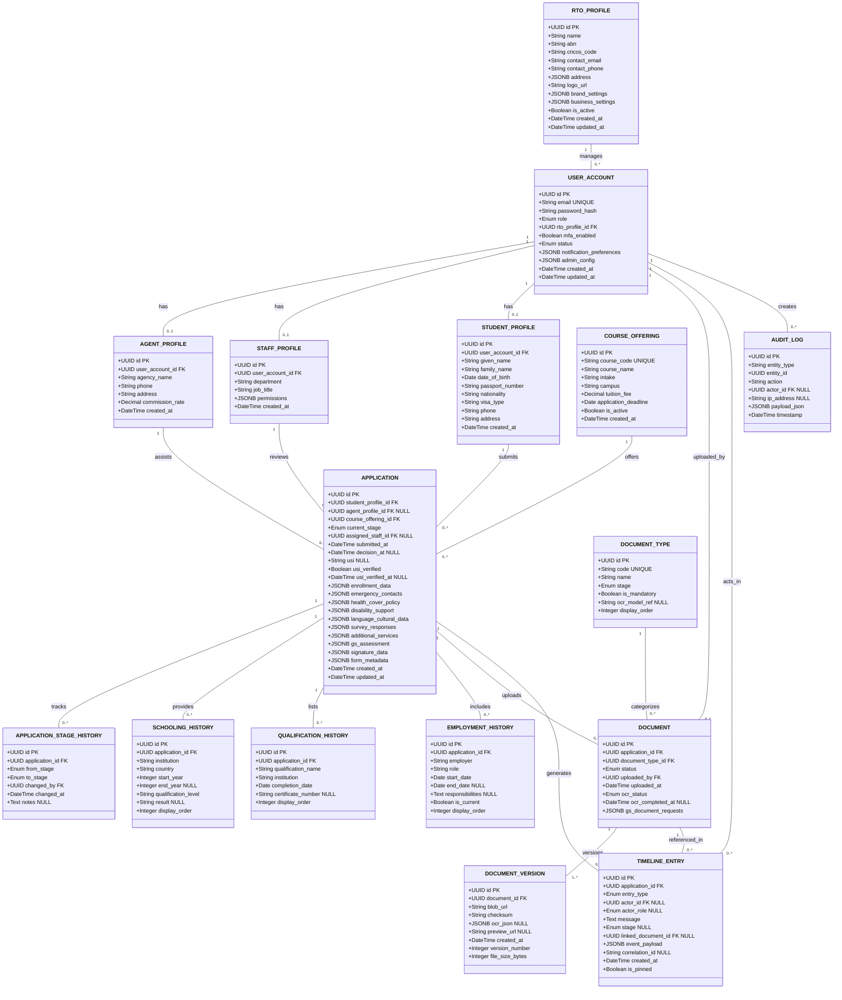
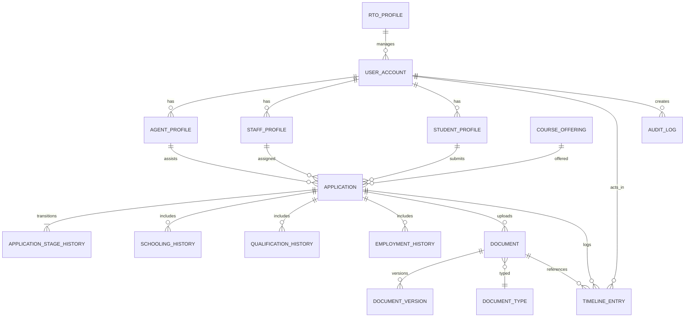

# Churchill Application Portal — Data Model Diagram
**Version:** 3.1  
**Last Updated:** November 14, 2025

This document provides visual representations of the database schema using both UML Class Diagrams (detailed attributes and types) and Entity-Relationship Diagrams (relationship-focused view).

**Architecture:** Lean JSONB-first approach - core workflow and frequently-queried history tables remain normalized, while all 1:1 relationships and low-query-frequency data are stored as JSONB for maximum flexibility and rapid iteration.

## UML Class Diagram

The UML class diagram below shows all entities with their attributes, data types, and relationships. Primary keys (PK) and foreign keys (FK) are explicitly marked.

**Total Tables: 16** (reduced from 34 for MVP simplicity)



---

## Entity Relationship Diagram

The diagram below captures the high-level entities and relationships for the lean 16-table schema. Most 1:1 relationships and low-frequency data are stored as JSONB within the APPLICATION table.



### Legend
- **Solid crow's-foot (`||--o{`)** indicates one-to-many.
- **Solid bar (`||`)** indicates exactly one; **open circle (`o`)** indicates zero-or-more.
- **JSONB fields in APPLICATION**: enrollment_data, emergency_contacts, health_cover_policy, disability_support, language_cultural_data, survey_responses, additional_services, gs_assessment, signature_data, form_metadata
- **JSONB fields in USER_ACCOUNT**: notification_preferences, admin_config
- **JSONB fields in DOCUMENT**: gs_document_requests
- **JSONB fields in TIMELINE_ENTRY**: event_payload (absorbs WORKFLOW_EVENT data)
- **JSONB fields in RTO_PROFILE**: address, brand_settings, business_settings

Use this diagram alongside `docs/solution-architecture.md` (section 5.1) for field-level details.

---

## Key Design Notes

### Lean JSONB-First Architecture Strategy

**Philosophy:** Start with minimal normalized tables (16 total) and use JSONB aggressively for MVP. Add normalized tables only when actual usage patterns demand it.

**Normalized Tables (Core Workflow & History):**
- **RTO_PROFILE**: RTO/organization metadata (for multi-tenancy)
- **USER_ACCOUNT, AGENT_PROFILE, STAFF_PROFILE, STUDENT_PROFILE**: Identity management
- **COURSE_OFFERING**: Course catalog
- **APPLICATION**: Central application record (with extensive JSONB fields)
- **APPLICATION_STAGE_HISTORY**: Workflow transitions (SLA reporting requires fast queries)
- **SCHOOLING_HISTORY, QUALIFICATION_HISTORY, EMPLOYMENT_HISTORY**: Variable-length history lists frequently queried
- **DOCUMENT_TYPE, DOCUMENT, DOCUMENT_VERSION**: Core domain object with versioning
- **TIMELINE_ENTRY**: High-volume time-series activity feed
- **AUDIT_LOG**: Immutable compliance trail

**Consolidated to JSONB (19 Former Tables → JSONB Fields):**

**In APPLICATION table:**
- `enrollment_data` → **REPLACES** COURSE_ENROLLMENT table
  ```json
  {
    "status": "enrolled",
    "offer_signed_at": "2025-11-10T14:30:00Z",
    "fee_received_at": "2025-11-15T09:00:00Z",
    "coe_uploaded_at": "2025-11-20T16:45:00Z"
  }
  ```

- `emergency_contacts` → **REPLACES** EMERGENCY_CONTACT table
  ```json
  [
    {"name": "John Doe", "relationship": "Father", "phone": "+61...", "email": "..."},
    {"name": "Jane Doe", "relationship": "Mother", "phone": "+61..."}
  ]
  ```

- `health_cover_policy` → **REPLACES** HEALTH_COVER_POLICY table
  ```json
  {
    "provider": "Allianz",
    "policy_number": "POL-123456",
    "start_date": "2025-02-01",
    "end_date": "2026-02-01",
    "coverage_type": "Basic"
  }
  ```

- `disability_support` → **REPLACES** DISABILITY_SUPPORT table
  ```json
  {
    "has_disability": true,
    "disability_details": "...",
    "support_required": "...",
    "documentation_status": "verified"
  }
  ```

- `language_cultural_data` → **REPLACES** LANGUAGE_CULTURAL_PROFILE table
  ```json
  {
    "first_language": "Mandarin",
    "other_languages": ["English", "Cantonese"],
    "indigenous_status": null,
    "country_of_birth": "China",
    "citizenship_status": "International Student"
  }
  ```

- `survey_responses` → **REPLACES** SURVEY_QUESTION + SURVEY_RESPONSE tables
  ```json
  [
    {"question_id": "uuid", "question_text": "How did you hear about us?", "answer": "Agent referral"},
    {"question_id": "uuid", "question_text": "Preferred study mode", "answer": "On-campus"}
  ]
  ```

- `additional_services` → **REPLACES** ADDITIONAL_SERVICE + APPLICATION_ADDITIONAL_SERVICE tables
  ```json
  [
    {"service_id": "uuid", "name": "Airport Pickup", "fee": 150.00, "selected_at": "2025-11-14T10:00:00Z"},
    {"service_id": "uuid", "name": "Accommodation Assistance", "fee": 200.00, "selected_at": "2025-11-14T10:00:00Z"}
  ]
  ```

- `gs_assessment` → **REPLACES** GS_ASSESSMENT table
  ```json
  {
    "interview_date": "2025-11-18T10:00:00Z",
    "staff_id": "uuid",
    "scorecard": {"genuine_intent": 8, "english_proficiency": 7, "financial_capacity": 9},
    "decision": "approved",
    "notes": "Strong candidate with clear study goals"
  }
  ```

- `signature_data` → **REPLACES** SIGNATURE_ENVELOPE + SIGNATURE_PARTY tables
  ```json
  {
    "envelope_id": "docuseal-123",
    "provider": "DocuSeal",
    "status": "completed",
    "cost_cents": 0,
    "expires_at": "2025-12-01T00:00:00Z",
    "completed_at": "2025-11-14T15:30:00Z",
    "parties": [
      {"role": "student", "name": "...", "email": "...", "signed_at": "2025-11-14T15:30:00Z"},
      {"role": "agent", "name": "...", "email": "...", "signed_at": "2025-11-14T14:00:00Z"}
    ]
  }
  ```

**In USER_ACCOUNT table:**
- `notification_preferences` → **REPLACES** NOTIFICATION_PREFERENCE table
  ```json
  {
    "email": {"enabled": true, "frequency": "instant", "mute_until": null},
    "sms": {"enabled": false},
    "in_app": {"enabled": true, "frequency": "instant"}
  }
  ```

- `admin_config` → **REPLACES** STAFF_ADMIN_CONFIG table
  ```json
  {
    "workflow_sla": {
      "submitted": {"target_hours": 24, "escalation_hours": 48},
      "staff_review": {"target_hours": 72, "escalation_hours": 120}
    },
    "default_templates": {...}
  }
  ```

**In DOCUMENT table:**
- `gs_document_requests` → **REPLACES** GS_DOCUMENT_REQUEST table
  ```json
  [
    {"requested_by": "uuid", "requested_at": "2025-11-15T10:00:00Z", "due_at": "2025-11-22T10:00:00Z", "status": "pending"},
    {"requested_by": "uuid", "requested_at": "2025-11-16T14:00:00Z", "due_at": "2025-11-23T14:00:00Z", "status": "fulfilled"}
  ]
  ```

**In TIMELINE_ENTRY table:**
- `event_payload` + `correlation_id` → **REPLACES** WORKFLOW_EVENT table
  ```json
  {
    "event_type": "offer_generated",
    "metadata": {...},
    "triggered_by": "system"
  }
  ```

**Dropped Entirely (Not Needed for MVP):**
- ❌ **NOTIFICATION** table → Use Celery task results + in-app toasts (can add persistent inbox later)
- ❌ **DOCUMENT_TEMPLATE** table → Use Azure Blob with filename conventions (`offer_letter_v2.docx`)
- ❌ **WORKFLOW_STAGE_SLA** table → Use YAML config file or `USER_ACCOUNT.admin_config` JSONB

**Result: 34 tables → 16 tables** (53% reduction for MVP)

### Data Types
- **UUID**: Universally unique identifiers for all primary keys
- **Enum**: Enumerated types for controlled vocabularies (e.g., `role`, `stage`, `status`)
- **JSONB**: Binary JSON for efficient storage and indexing (supports GIN indexes for nested queries)
- **JSON**: Standard JSON for simple metadata, OCR output, scorecards, permissions
- **DateTime**: Timestamps with timezone support (UTC)
- **Decimal**: Precise decimal values for financial data (fees, commissions)

### JSONB Indexing Strategy
For optimal performance on JSON fields:
```sql
-- APPLICATION table JSONB indexes
CREATE INDEX idx_application_enrollment ON application USING GIN (enrollment_data);
CREATE INDEX idx_application_emergency ON application USING GIN (emergency_contacts);
CREATE INDEX idx_application_health_cover ON application USING GIN (health_cover_policy);
CREATE INDEX idx_application_disability ON application USING GIN (disability_support);
CREATE INDEX idx_application_language ON application USING GIN (language_cultural_data);
CREATE INDEX idx_application_survey ON application USING GIN (survey_responses);
CREATE INDEX idx_application_services ON application USING GIN (additional_services);
CREATE INDEX idx_application_gs_assessment ON application USING GIN (gs_assessment);
CREATE INDEX idx_application_signatures ON application USING GIN (signature_data);

-- USER_ACCOUNT JSONB indexes
CREATE INDEX idx_user_notification_prefs ON user_account USING GIN (notification_preferences);
CREATE INDEX idx_user_admin_config ON user_account USING GIN (admin_config);

-- DOCUMENT JSONB indexes
CREATE INDEX idx_document_gs_requests ON document USING GIN (gs_document_requests);

-- TIMELINE_ENTRY JSONB indexes
CREATE INDEX idx_timeline_event_payload ON timeline_entry USING GIN (event_payload);
CREATE INDEX idx_timeline_correlation ON timeline_entry(correlation_id) WHERE correlation_id IS NOT NULL;

-- Query examples:
-- Find applications with health cover expiring soon
SELECT * FROM application 
WHERE (health_cover_policy->>'end_date')::date < CURRENT_DATE + INTERVAL '30 days';

-- Find students who speak Mandarin
SELECT * FROM application 
WHERE language_cultural_data->>'first_language' = 'Mandarin';

-- Find enrolled applications
SELECT * FROM application 
WHERE enrollment_data->>'status' = 'enrolled';

-- Find applications with specific emergency contact relationships
SELECT * FROM application 
WHERE emergency_contacts @> '[{"relationship": "Parent"}]';
```

### When to Promote JSONB to Normalized Tables

**Triggers for Normalization:**

1. **Complex JOIN Requirements**
   - If you need to join emergency contacts with other entities frequently
   - Example: "Show all agents whose emergency contacts share the same phone number" (fraud detection)
   - → Promote `APPLICATION.emergency_contacts` to `EMERGENCY_CONTACT` table

2. **High-Volume Filtering/Sorting**
   - GIN indexes on JSONB work well for existence checks
   - But if filtering on specific JSONB fields becomes a hot query path (e.g., sorting by health cover expiry date across 10,000+ applications)
   - → Promote to normalized table for B-tree index efficiency

3. **Referential Integrity Enforcement**
   - JSONB stores `service_id` as text, no FK constraint
   - If additional services catalog grows to 100+ items and consistency matters
   - → Promote `APPLICATION.additional_services` to `APPLICATION_ADDITIONAL_SERVICE` junction table

4. **Third-Party Tool Integration**
   - If non-PostgreSQL BI tools struggle with JSONB queries
   - → Materialize JSONB to normalized views or tables

5. **Scale Thresholds**
   - **< 5,000 applications**: JSONB handles this easily with GIN indexes
   - **5,000-20,000 applications**: Monitor query performance, consider selective normalization
   - **20,000+ applications**: Likely need to normalize high-frequency JSONB queries

**Migration is Easy:**
```sql
-- Example: Promote emergency_contacts JSONB to table
CREATE TABLE emergency_contact AS
SELECT
  gen_random_uuid() AS emergency_contact_id,
  application_id,
  (contact->>'name')::varchar AS contact_name,
  (contact->>'relationship')::varchar AS relationship,
  (contact->>'phone')::varchar AS phone_number,
  (contact->>'email')::varchar AS email
FROM application,
LATERAL jsonb_array_elements(emergency_contacts) AS contact;

-- Add indexes and constraints
CREATE INDEX idx_emergency_contact_application ON emergency_contact(application_id);
ALTER TABLE emergency_contact ADD CONSTRAINT fk_application 
  FOREIGN KEY (application_id) REFERENCES application(application_id);
```

**Current Recommendation:**
- Start with 15-table lean schema for MVP
- Monitor actual query patterns for 3-6 months
- Normalize only when data (not assumptions) proves it's needed

### Relationship Cardinality
- **1 to 0..1**: Optional one-to-one (e.g., APPLICATION has optional enrollment_data JSONB)
- **1 to 0..***: Optional one-to-many (e.g., APPLICATION has array of emergency_contacts in JSONB, APPLICATION to DOCUMENT)
- **1 to 1..***: Mandatory one-to-many (e.g., DOCUMENT to DOCUMENT_VERSION)

### Multi-Tenancy
All tables implicitly filtered by `tenant_id` via row-level security policies in PostgreSQL. The `USER_ACCOUNT.tenant_id` propagates down through all relationships.

### Versioning & Audit Trail
- **DOCUMENT_VERSION**: Immutable history of document changes
- **APPLICATION_STAGE_HISTORY**: Tracks all workflow transitions (required for SLA reporting)
- **AUDIT_LOG**: Comprehensive event log for compliance (superset of TIMELINE_ENTRY)
- **TIMELINE_ENTRY**: User-facing activity feed with JSONB event_payload for flexibility

### Indexes (Recommended for 15-Table Schema)
Critical indexes for query performance:
- **APPLICATION**: `current_stage`, `assigned_staff_id`, `submitted_at`, `course_offering_id`, `student_profile_id`, `agent_profile_id`
- **APPLICATION JSONB**: GIN indexes on all 10 JSONB fields (enrollment_data, emergency_contacts, health_cover_policy, disability_support, language_cultural_data, survey_responses, additional_services, gs_assessment, signature_data, form_metadata)
- **TIMELINE_ENTRY**: `application_id`, `created_at`, `correlation_id` (partial index), GIN on `event_payload`
- **DOCUMENT**: `application_id`, `uploaded_at`, `status`, `document_type_id`, GIN on `gs_document_requests`
- **USER_ACCOUNT**: `email`, `tenant_id`, GIN on `notification_preferences` and `admin_config`
- **SCHOOLING_HISTORY**: `application_id`, `country`
- **QUALIFICATION_HISTORY**: `application_id`
- **EMPLOYMENT_HISTORY**: `application_id`
- **APPLICATION_STAGE_HISTORY**: `application_id`, `transitioned_at` (for SLA queries)

---

## Schema Comparison: Normalized vs Hybrid vs Lean

| Aspect | v1.0 Normalized (34 tables) | v2.0 Hybrid (28 tables) | v3.1 Lean (16 tables) |
|--------|----------------------------|------------------------|----------------------|
| Total tables | 34 | 28 | 16 |
| Reduction | Baseline | -18% | -53% |
| Query performance | Excellent | Excellent | Good (GIN indexed) |
| Schema flexibility | Rigid | Moderate | Very flexible |
| Data integrity | Strong FK | Strong FK | JSONB arrays |
| Join complexity | Highest | Moderate | Lowest |
| Migration effort | Highest | Moderate | Lowest |
| Storage efficiency | Good | Better | Best (less fragmentation) |
| Development velocity | Slower | Moderate | Fastest |
| MVP suitability | Over-engineered | Good | **Optimal** |
| Scale ceiling | 100k+ apps | 50k+ apps | 20k apps (then normalize) |

### When to Add Back Normalized Tables

If usage patterns change, easily promote JSONB to tables:
- **Emergency contact fraud detection** → Create `EMERGENCY_CONTACT` table with phone deduplication
- **Health cover compliance reporting** → Create `HEALTH_COVER_POLICY` table with date range indexes
- **Survey analytics dashboard** → Create `SURVEY_QUESTION` + `SURVEY_RESPONSE` tables
- **Additional services catalog management** → Create `ADDITIONAL_SERVICE` + junction table
- **GS assessment reporting** → Create `GS_ASSESSMENT` table with scorecard analytics
- **Notification inbox feature** → Create `NOTIFICATION` table with read/unread tracking
- **Template versioning** → Create `DOCUMENT_TEMPLATE` table with Azure Blob references
- **Workflow SLA enforcement** → Create `WORKFLOW_STAGE_SLA` table with escalation logic

PostgreSQL makes this migration straightforward:
```sql
-- Example: Extracting emergency contacts to normalized table
CREATE TABLE emergency_contact AS
SELECT 
    gen_random_uuid() AS emergency_contact_id,
    application_id,
    (contact->>'name')::varchar AS contact_name,
    (contact->>'relationship')::varchar AS relationship,
    (contact->>'phone')::varchar AS phone_number,
    (contact->>'email')::varchar AS email,
    (contact->>'is_primary')::boolean AS is_primary
FROM application,
LATERAL jsonb_array_elements(emergency_contacts) AS contact;

-- Add constraints and indexes
ALTER TABLE emergency_contact ADD CONSTRAINT fk_application 
  FOREIGN KEY (application_id) REFERENCES application(application_id);
CREATE INDEX idx_emergency_contact_application ON emergency_contact(application_id);
CREATE INDEX idx_emergency_contact_phone ON emergency_contact(phone_number);
```

---

## Changelog
- **v1.0 (2025-11-14)**: Initial ER diagram created; added COURSE_OFFERING, DOCUMENT_TEMPLATE, WORKFLOW_STAGE_SLA entities.
- **v1.1 (2025-11-14)**: Added comprehensive UML class diagram with all attributes, data types, and relationship cardinalities; included design notes on multi-tenancy, versioning, and recommended indexes.
- **v2.0 (2025-11-14)**: **BREAKING CHANGE** - Refactored to hybrid architecture: consolidated `LANGUAGE_CULTURAL_PROFILE`, `USI_RECORD`, `SURVEY_QUESTION`, and `SURVEY_RESPONSE` tables into JSONB columns within `APPLICATION` table. Reduced schema from 34 to 28 tables while maintaining query performance on frequently-accessed data. Added JSONB indexing strategies and migration guidance.
- **v3.0 (2025-11-14)**: **MAJOR BREAKING CHANGE** - Adopted lean JSONB-first MVP approach: consolidated 19 additional tables into JSONB fields. Reduced schema from 34 to 15 tables (56% reduction). Consolidated: `COURSE_ENROLLMENT`, `EMERGENCY_CONTACT`, `HEALTH_COVER_POLICY`, `DISABILITY_SUPPORT`, `ADDITIONAL_SERVICE`, `APPLICATION_ADDITIONAL_SERVICE`, `GS_ASSESSMENT`, `SIGNATURE_ENVELOPE`, `SIGNATURE_PARTY` into `APPLICATION` table JSONB fields. Consolidated `NOTIFICATION_PREFERENCE`, `STAFF_ADMIN_CONFIG` into `USER_ACCOUNT` JSONB. Consolidated `GS_DOCUMENT_REQUEST` into `DOCUMENT` JSONB. Merged `WORKFLOW_EVENT` into `TIMELINE_ENTRY` with `event_payload` JSONB. Dropped `NOTIFICATION`, `DOCUMENT_TEMPLATE`, `WORKFLOW_STAGE_SLA` tables (replaced by Celery logs, Azure Blob conventions, config files). Added comprehensive JSONB examples, migration triggers, and normalization guidance for scale-up scenarios.
- **v3.1 (2025-11-14)**: Added `RTO_PROFILE` table for organization/multi-tenancy management (15 → 16 tables). Renamed `USER_ACCOUNT.tenant_id` to `rto_profile_id`. RTO_PROFILE stores organization metadata (name, ABN, CRICOS, branding, business settings) with JSONB for flexible configuration. Enables future multi-RTO SaaS expansion while keeping MVP lean.
- **v3.0 (2025-11-14)**: **MAJOR BREAKING CHANGE** - Adopted lean JSONB-first MVP approach: consolidated 19 additional tables into JSONB fields. Reduced schema from 34 to 15 tables (56% reduction). Consolidated: `COURSE_ENROLLMENT`, `EMERGENCY_CONTACT`, `HEALTH_COVER_POLICY`, `DISABILITY_SUPPORT`, `ADDITIONAL_SERVICE`, `APPLICATION_ADDITIONAL_SERVICE`, `GS_ASSESSMENT`, `SIGNATURE_ENVELOPE`, `SIGNATURE_PARTY` into `APPLICATION` table JSONB fields. Consolidated `NOTIFICATION_PREFERENCE`, `STAFF_ADMIN_CONFIG` into `USER_ACCOUNT` JSONB. Consolidated `GS_DOCUMENT_REQUEST` into `DOCUMENT` JSONB. Merged `WORKFLOW_EVENT` into `TIMELINE_ENTRY` with `event_payload` JSONB. Dropped `NOTIFICATION`, `DOCUMENT_TEMPLATE`, `WORKFLOW_STAGE_SLA` tables (replaced by Celery logs, Azure Blob conventions, config files). Added comprehensive JSONB examples, migration triggers, and normalization guidance for scale-up scenarios.
